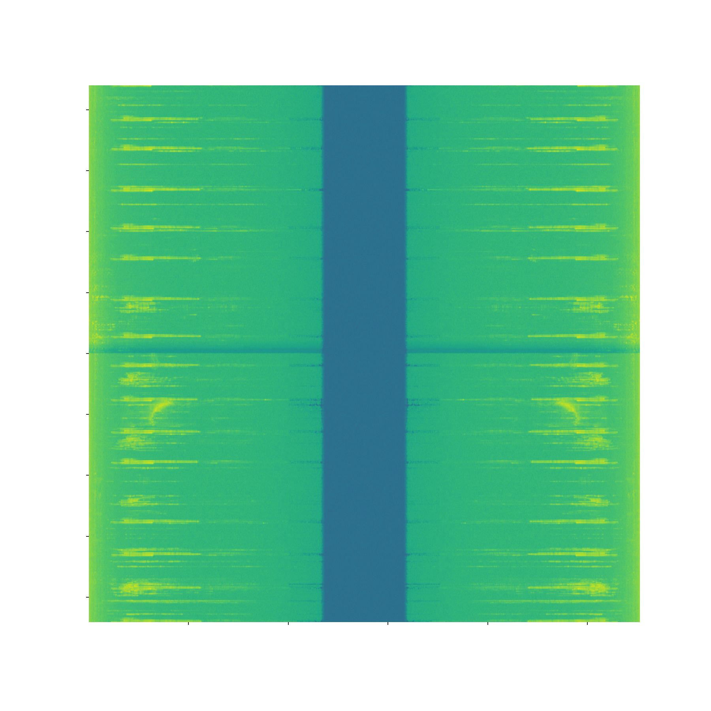
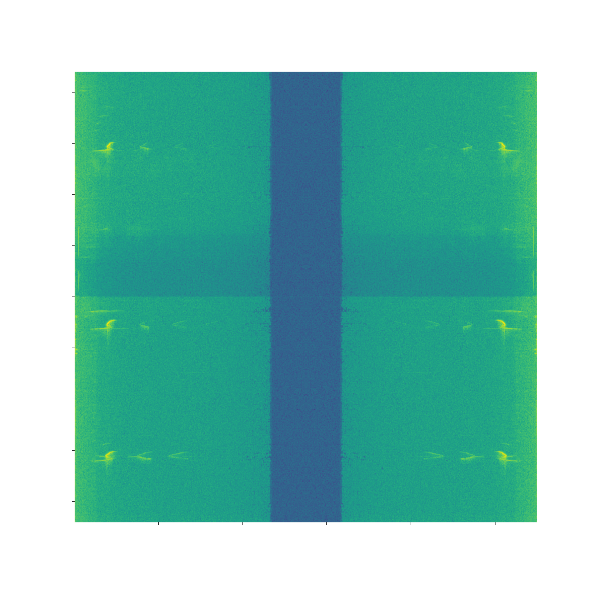
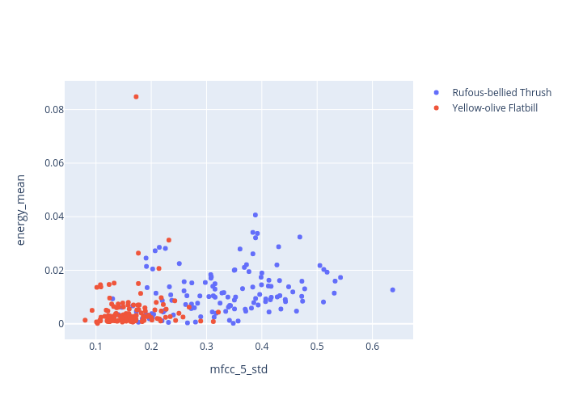

# Zaprojektuj proces zbudowania aplikacji służącej do rozpoznawania skończonej liczby różnych gatunków ptaków na podstawie danych dźwiękowych. 

Firstly, I consentrated on searching for available databases of bird audio samples

[xeno-canto.org](https://xeno-canto.org/)
provides a wide open source database of audio samples in the mp3 format. Fortunately, in the legal notice they don't prohibit downloading and personal use of the dataset.

Secondly, I made a simple scrapper that collected information of the records. The most important features for me were
- name
- path to the source file
- class (quality of recording)
- type

Unfortunately, the scrapping was a time-consuming process. I collected about only 30000 records during 4 hours. The collected information was saved in a json file [here](./data/info_wo_audio.json).

Then the gathered inforation I transformed to a pandas DataFrame [here](./nb_spec_audio_scrapper.ipynb) and filtered only the records of *A* class. Than there were selected two most frequent kind of birds and their audio samples were downloaded and saved locally.

## 1) Zaproponuj formę danych i sposób budowy bazy danych przeznaczonych do procesu nauczania.

Despite I stored information locally: record info as a json file and audio files in a directory. I  would suggest to store the data in MongoDB. 
In the dataset I collected there were only few files with size greater than 16 Mb. Very simplified example is [here](./nb_store_db.ipynb). Therefore extensive use of GridFS is not required.

## 2) Jak określisz wielkość bazy danych niezbędną do przeprowadzenia procesu nauczania?

As I collected information, I noticed the numbers of records available to a particular bird kind are not balanced. Therefore, methinks, it is reasonable to use only the kinds those have sufficient number of audia samples. In this case the sufficient number will depend on the future model used for classification.  

## 3) Jaki algorytm/algorytmy nauczania zastosujesz? Na jakiej podstawie go wybierzesz?

To be frank, the tolpic is new for me. Thus I googled the following articles
[audio-deep-learning-made-simple-sound-classification](https://towardsdatascience.com/audio-deep-learning-made-simple-sound-classification-step-by-step-cebc936bbe5)

[Introduction to Audio Classification](https://www.analyticsvidhya.com/blog/2021/06/introduction-to-audio-classification/#:~:text=Audio%20classification%20or%20sound%20classification,process%20of%20analyzing%20audio%20recordings.&text=Followed%20by%20pre%2Dprocessing%2C%20creating,in%20either%20speech%20or%20music.)

They suggest to transform the audio files to spectrograms and then apply CNN.
However, in my particular case the audio samples mostly short repeating fragments. 

Therefore the spectrograms a required high resolution that would make expand the neural network extensively. I realized I  would not able to launch the model quickly. Therefore I was looking for a tool for extracting these repeating sequances. And I found the following article:

[Audio Analysis](https://medium.com/behavioral-signals-ai/intro-to-audio-analysis-recognizing-sounds-using-machine-learning-20fd646a0ec5)

This approach offers a feature extractions.

## 4) W jaki sposób zwalidujesz uczony model?

The entery analysis of the data showed that the validation will require a special attention. I would use a cross validation. 

## 5) Jakie parametry wykorzystane w procesie nauczania będziesz zmieniać w celu optymalizacji działania modelu?

In case of proceeding spectrograms with CNN I would try to extract minimal feature of the sound (one period) and reducing picture resolution.

In the case of audio analysis of Theodoros Giannakopoulos, I would start for manipulation of the fragment windows and their overlaping. Finding the features those most destinguish birds. 

## 6) Jakie przedstawisz wymagania dla urządzenia, na którym zbudowana aplikacja będzie uruchomiona? Jakie parametry/podzespoły są istotne w analizowanym przypadku?

To be frank, at the moment I can't answer this question.

## 7) W jaki sposób może objawić się zjawisko przetrenowania modelu? Jaki wpływ będzie miało przetrenowanie na działanie gotowej aplikacji?

In this particular dataset with a low number of samples every feature is quite valuable. Therefore it is difficult to answer the question of overfitting. However I would like to keep the model as tiny as possible.  